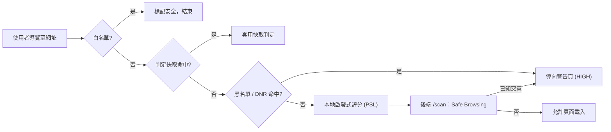
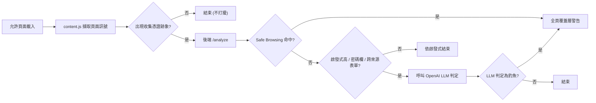

# Phishing Guard 

---

## 1 專案概述

### 1.1 目標
打造一個能在使用者瀏覽網頁時，**即時、自動偵測釣魚與惡意網站**的瀏覽器擴充功能，
並提供「整頁連結掃描」與「AI 診斷」等主動檢查能力。

### 1.2 運作流程
- **開啟網頁時自動防護**
  - 使用者輸入網址或開啟新頁面時，擴充功能會在背景自動檢查目前網址。
  - 若在載入前判定為高風險，會顯示完整紅色警告頁：
    - `Deceptive site blocked`：代表疑似釣魚網站。
    - `Dangerous site blocked`：代表疑似惡意軟體網站。
  - 使用者可選擇 `Back to safety` 關閉分頁，或選擇 `Proceed anyway` 自行承擔風險繼續前往。
  - 若頁面載入後才判定為可疑登入頁，系統會顯示紅色覆蓋警告並列出原因。
  - 工具列徽章會在可疑或危險頁面顯示 `!`。

- **彈出視窗**
  - 點擊插件圖示後，會彈出目前分頁的安全狀態快照。
  - 視窗包含以下資訊與操作：
    - `Risk`：顯示 `Safe`、`Suspicious` 或 `Dangerous`，並附上原因與偵測來源
      （`allowlist` / `blocklist` / `heuristics` / `safe-browsing` / `llm`）。
    - `Trust this site`：將目前網站加入個人允許清單，未來跳過該網站所有檢查。
    - `Enable toggle`：開啟或關閉防護功能。
    - `Blocklist: N URLs`：顯示已同步的已知惡意 URL 數量，並提供 `Refresh` 更新。

- **掃描頁面上的連結**
  - 開啟彈出視窗時，系統會自動掃描目前頁面上的所有連結。
  - 掃描結果會顯示：
    - `found`：頁面中找到的連結數量。
    - `unique`：去除重複後的連結數量。
    - `risky`：被判定為有風險的連結數量。
  - 若發現風險連結，會列出完整 URL。此功能適合用於搜尋結果、網頁郵件與論壇等含有大量外部連結的情境。

- **AI 診斷**
  - 使用者點擊彈出視窗中的診斷按鈕後，AI 會檢查頁面連結。
  - AI 會標記一般規則可能漏掉的仿冒連結，例如：
    - 仿冒拼字。
    - 品牌冒充網域。
    - 裸 IP 主機。
  - 每個可疑項目都會附上信心分數與判斷原因。
  - 此功能需要後端 OpenAI 金鑰，且會產生付費 API 使用量。


### 1.3 核心技術
- API 金鑰串接：透過 API 金鑰整合 OpenAI、Google Safe Browsing 等外部服務。
- 採用分層偵測（tiered cascade）架構：先用免費、即時、本地的檢查處理大部分危險的情境，只有在真的需要時才呼叫 LLM，藉此把成本與延遲壓到最低。
- 後端代理伺服器：瀏覽器擴充功能無法安全地保存 API 金鑰 （可能藉由解壓縮擴充功能讀出金鑰），因此金鑰必須放在伺服器端。
- Google Cloud Run 部署：免費額度、自動 HTTPS、可縮放至零，免維運。

<div style="height: 1.2em;"></div>

---

## 2 系統架構
### 2.1 分層偵測級聯（Tiered Cascade）

| 層級 | 位置 | 成本 | 內容 |
| --- | --- | --- | --- |
| 1. 白名單 | 擴充功能 | 免費、即時 | 對信任的大型網站略過所有檢查 |
| 2a. 黑名單 | 擴充功能 | 免費、即時、可離線 | OpenPhish + URLhaus 動態同步，經由 declarativeNetRequest 強制阻擋 |
| 2b. 啟發式規則 | 擴充功能 | 免費、即時 | Punycode、仿冒網域、IP 主機、可疑 TLD、過深子網域、亂度（PSL 精準解析） |
| 3. 信譽查詢 | 後端 | 免費 | Google Safe Browsing 查詢已知惡意網址 |
| 4. LLM 判定 | 後端 | 付費 | 對出現收集憑證跡象的未知頁面，由 OpenAI 判斷 |

判定結果以 **網址路徑（origin + path）** 為單位快取，重複造訪不再產生成本。

此外提供兩項由使用者於 popup 主動觸發的功能（見 §3.3）：
- **整頁連結掃描**（開啟 popup 時自動執行）— 對頁面上所有連結套用第 1～3 層規則。
- **🤖 AI 診斷**（按鈕）— 把頁面連結交給 LLM，僅憑網址字串判斷是否為釣魚。

### 2.2 兩階段偵測
Manifest V3 無法在請求進行中暫停並等待伺服器回應，因此設計為兩階段：

- **第一階段（導覽時，`background.js`）**：白名單 → 快取 → 黑名單 → 啟發式 → 後端 `/scan`。
  已知惡意網址在頁面載入前就被導向警告頁。
- **第二階段（頁面載入後，`content.js`）**：擷取頁面訊號 → 後端 `/analyze`，
  必要時才升級到 LLM；若判定為釣魚則覆蓋全頁警告層。

<div style="page-break-after: always;"></div>

### 2.3 專案結構

```
phishing-extension/
├── extension/                 # MV3 擴充功能（純 JS，免建置）
│   ├── manifest.json          # 權限：webNavigation/tabs/storage/alarms/declarativeNetRequest/scripti，ng
│   ├── config.js              # 後端網址、API 權杖、快取 TTL、風險等級
│   ├── background.js          # 第一階段級聯、黑名單/DNR 生命週期、連結掃描、AI 診斷
│   ├── content.js             # 第二階段頁面訊號擷取 + 警告覆蓋層
│   ├── lib/
│   │   ├── allowlist.js       # 內建信任網域 + 仿冒比對品牌清單
│   │   ├── heuristics.js      # 本地啟發式規則（使用 PSL）
│   │   ├── blocklist.js       # OpenPhish/URLhaus 動態同步、解析、查詢
│   │   ├── dnr.js             # 黑名單 → declarativeNetRequest 規則
│   │   ├── psl.js             # Public Suffix List 演算法
│   │   ├── psl-data.js        # 內建 PSL 資料（自動產生）
│   │   └── generate_psl.py    # 重新產生 PSL 資料
│   ├── icons/                 # 盾牌圖示 16/32/48/128 + generate_icons.py
│   ├── popup/                 # 狀態 UI、開關、信任此網站、黑名單、連結掃描、AI 診斷
│   └── warning/               # 全頁攔截警告頁
├── backend/                   # Node/Express 代理（保存金鑰）
│   ├── server.js              # /scan /scan-batch /diagnose-links /analyze、權杖、CORS、速率限制
│   ├── Dockerfile             # 容器化（Cloud Run / VM 通用）
│   ├── .dockerignore
│   ├── .env.example
│   └── src/
│       ├── classify.js        # 風險/分類純函式（可測試）
│       ├── safeBrowsing.js    # Safe Browsing 串接（單筆 + 批次）
│       ├── llm.js             # OpenAI 串接（頁面分析 + 網址清單判定）
│       └── cache.js           # TTL 快取
├── tests/                     # Node 內建測試（25 項）
├── .github/workflows/
│   └── deploy-backend.yml     # CI/CD：推送時自動部署 Cloud Run
├── README.md                  # 安裝與使用說明
├── DEPLOY.md                  # 雲端部署教學（Cloud Run / VM / GitHub Actions）
├── progress.md                # 本報告
└── package.json               # 測試執行器（npm test）
```

<div style="page-break-after: always;"></div>

### 2.4 系統元件圖


### 2.5 偵測級聯流程圖

圖 1：導覽前 / 第一階段偵測


圖 2：頁面載入後 / 第二階段偵測


<div style="height: 1.2em;"></div>

---

## 3 各模組功能詳述
### 3.1 擴充功能（前端）
**白名單（`lib/allowlist.js`）**
- 內建約 50 個高信任網域（含台灣相關：`gov.tw`、`edu.tw`、`nycu.edu.tw`、
  各大銀行與電商）。
- 使用者可透過 popup 的「信任此網站」加入個人白名單，儲存於 `chrome.storage.local`。

**啟發式規則（`lib/heuristics.js`）**
- 偵測：Punycode／IDN 同形異義攻擊、原始 IP 主機、網址含 `@`、可疑 TLD、
  過深子網域、與知名品牌的編輯距離（仿冒）、字串亂度、超長網址。
- 以 **Public Suffix List** 正確解析可註冊網域（eTLD+1）。

**離線黑名單（`lib/blocklist.js` + `lib/dnr.js`）**
- 每 6 小時透過 `chrome.alarms` 同步兩個免費、免金鑰的來源：
  - **OpenPhish** 社群 feed → 釣魚
  - **URLhaus**（abuse.ch）online feed → 惡意軟體
- 條目正規化為 `主機 + 路徑`（去除 scheme／query／fragment），即使帶追蹤參數也能比對，
  且不會誤擋整個共用主機。
- 透過 **declarativeNetRequest 動態規則**在網路層攔截：在請求送出前、甚至在
  service worker 休眠時都能阻擋。「仍要前往」會新增較高優先權的 allow 規則以避免無限重導。

**UI（`popup/`、`warning/`）**
- Popup：當前網站風險（✅／⚠️／⛔）、偵測來源、原因、啟用開關、信任此網站、
  黑名單數量與手動更新按鈕，以及整頁連結掃描與 AI 診斷（見 §3.3）。
- 警告頁／覆蓋層：依威脅類型顯示「釣魚」或「惡意軟體」不同文案，提供「返回安全」
  （直接關閉分頁，最可靠）與「仍要前往」。

### 3.2 後端代理（backend）
- **`POST /scan`**：僅憑網址，Safe Browsing + 啟發式分數 → 風險等級。
- **`POST /scan-batch`**：一次處理多筆網址（整頁掃描用），單一 Safe Browsing 呼叫
  即可涵蓋整頁，避免逐筆請求觸發速率限制。
- **`POST /diagnose-links`**：把網址清單交給 LLM，僅憑字串判斷釣魚（AI 診斷用）。
- **`POST /analyze`**：網址 + 頁面訊號，必要時升級至 OpenAI。
- **安全**：`API_TOKEN` 共享權杖驗證（保護會花費 OpenAI 額度的端點）、可設定 CORS
  來源、`trust proxy`（在 Cloud Run 後方取得真實 IP）、每 IP token-bucket 速率限制。
- 保存 API 金鑰、依路徑快取判定結果。
- **優雅降級**：缺 Safe Browsing 金鑰時跳過該層；缺／無法使用 OpenAI 時退回啟發式。

### 3.3 整頁連結掃描 + AI 診斷（popup 主動功能）
- **自動連結掃描**：開啟 popup 時，`background.js` 以 `chrome.scripting` 注入收集頁面
  所有 `<a href>`，依 `主機+路徑` 去重，逐一套用第 1～3 層規則（未知者批次送 `/scan-batch`）。
  popup 即時顯示 **found（找到）/ unique（去重後）/ risky（風險）** 三個數字與風險連結
  （顯示完整網址）。LLM 不參與此流程（不逐一開啟連結頁面）。
- **🤖 AI 診斷**：按鈕觸發，將頁面連結（排除白名單、上限 40 筆）送至 `/diagnose-links`，
  由 LLM 僅憑網址字串判斷（仿冒、可疑子網域、原始 IP 等），列出被標記的連結與信心度／原因。
- 兩者互補：自動掃描快速、免費、規則式；AI 診斷可抓出規則漏掉的新型仿冒，但需 OpenAI 計費。

<div style="height: 1.2em;"></div>

---

## 4 雲端部署（Google Cloud Run）

- **容器化**：`backend/Dockerfile`（Node 24 Alpine），Cloud Run 與一般 Docker 主機通用。
- **部署指令**（從原始碼建置）：
  ```bash
  gcloud run deploy phishing-guard --source backend --region asia-east1 \
    --allow-unauthenticated --max-instances 1 \
    --set-env-vars "OPENAI_API_KEY=...,OPENAI_MODEL=gpt-4o-mini,GOOGLE_SAFE_BROWSING_KEY=...,API_TOKEN=..."
  ```
  - `asia-east1`（台灣）延遲最低；`--max-instances 1` 維持快取一致並控制成本；縮放至零。
- **CI/CD**：`.github/workflows/deploy-backend.yml` 在 `backend/**` 變更推送到 `main` 時自動
  重新部署，使用 GitHub Secrets（`GCP_SA_KEY`、`GCP_PROJECT_ID`、各金鑰、`API_TOKEN`）。
- **安全**：擴充功能於每次請求送出 `Authorization: Bearer <API_TOKEN>`；後端據此擋掉
  未授權呼叫，避免他人盜用 OpenAI 額度。權杖會隨擴充功能散布，屬「防濫用」等級而非強式驗證。
- **成本**：Google 端在免費額度內約為 $0；唯一實質花費是 OpenAI 使用量（Safe Browsing 免費）。
  建議於 Billing 設定預算警示。
- 詳細逐步教學見本專案的 github 內的 [DEPLOY.md](https://github.com/Matthew-HMS/phishing-extension/blob/main/DEPLOY.md)。

<div style="height: 1.2em;"></div>

---

## 5 開發歷程與解決的問題

開發過程中，透過實際測試發現並修正了多個真實問題：

| # | 問題 | 解法 |
| --- | --- | --- |
| 1 | `.env` 放在專案根目錄，後端讀不到（顯示金鑰未設定） | 移至 `backend/.env`（dotenv 的讀取位置） |
| 2 | 警告頁「返回」按鈕卡住（釣魚頁已進入歷史，返回又被擋，形成迴圈） | 改為透過背景訊息**關閉分頁**，最可靠 |
| 3 | 只有釣魚警告，無法區分惡意軟體 | 依 Safe Browsing 威脅類型分為 phishing／malware，UI 文案與圖示隨之變化 |
| 4 | **快取以主機為鍵造成污染**：同主機某頁的判定會套用到所有路徑（malware 被誤標成 phishing） | 改以 `origin + path` 為快取鍵（前後端一致） |
| 5 | OpenPhish `feed.txt` 已改為 302 轉址到 GitHub | 直接指向 GitHub raw 來源 |
| 6 | **啟發式對 `.tw`／`.co.uk` 完全失效**：把 `paypa1.com.tw` 的可註冊網域誤判為 `com.tw` | 導入 **Public Suffix List** 正確解析 eTLD+1 |
| 7 | 導入 PSL 後 `user.github.io` 被誤判（品牌字串出現在公用後綴中） | 品牌比對只在「非後綴」部分進行 |
| 8 | DNR 阻擋與「仍要前往」會互相衝突造成重導迴圈 | 「仍要前往」新增較高優先權的 allow 規則 |
| 9 | **LLM 一直回 429 `billing_not_active`**：實為 shell 環境變數中的舊金鑰蓋過 `.env` 的有效金鑰（dotenv 預設不覆寫既有環境變數） | 改用 `dotenv.config({ override: true })`，讓 `.env` 金鑰優先 |
| 10 | `整頁連結掃描`逐筆查 Safe Browsing 會觸發速率限制 | 新增 `/scan-batch`，一次呼叫涵蓋整頁 |

<div style="height: 1.2em;"></div>

---

## 6 測試
### 6.1 node
- 以 Node 內建測試框架（`node --test`）涵蓋所有純邏輯，於專案根目錄執行：
  ```bash
  npm test     # 共 25 項，全數通過
  ```
- 涵蓋範圍：PSL 解析（含 `.tw`、`github.io`、萬用字元／例外規則）、啟發式規則
  （仿冒偵測、`github.io` 誤判修正、結構性紅旗）、黑名單正規化與 feed 解析、
  DNR 規則產生、後端風險／分類對應。
- 實機驗證：以 Google 官方測試網址確認釣魚／惡意軟體分類與攔截皆正確；
  以構造的釣魚 payload 驗證 LLM `/analyze` 與 `/diagnose-links` 回傳正確判定。
### 6.2 llm
- LLM 層（`backend/src/llm.js`，預設模型 `gpt-4o-mini`）**已完整實作、串接並實測通過**：
  - `/analyze`：對仿冒 PayPal 的頁面回傳 `source:"llm"`、`risk:"HIGH"` 並附 `explanation`。
  - `/diagnose-links`：正確放行 google／wikipedia，標記 typosquat、品牌仿冒、原始 IP 等。
- 先前的 429 錯誤已查明為 shell 舊金鑰蓋過 `.env`（見 §5 問題 9），修正後運作正常。

<div style="height: 1.2em;"></div>

---

## 7 隱私設計
- 白名單網站完全不發出任何網路請求。
- 僅傳送網址與**輕量**頁面訊號（標題、文字片段、表單目標「主機名稱」、欄位數量），
  **不傳送**欄位內容、token 或 cookie。
- LLM 層僅在「未知且疑似收集憑證」的頁面，或使用者主動點擊 AI 診斷時才會被觸發。

<div style="height: 1.2em;"></div>

---

## 8 框架限制與後續工作
### 8.1 限制
- **隱私外洩風險**：當頁面需要送交線上 LLM 判斷時，雖然系統只會傳送必要的頁面文字與連結資訊，
  但仍可能包含使用者正在瀏覽的服務名稱、頁面內容或部分表單上下文。因此本系統將 LLM 觸發條件限制在
  「未知且疑似收集憑證」或使用者主動診斷的情境，以降低不必要的資料外送。
- **小模型判斷能力有限**：目前後端使用較輕量的模型以平衡成本與延遲，但若攻擊者能同時避開啟發式規則、
  品牌比對與黑名單檢查，該攻擊通常也具備較強的偽裝能力，小模型可能無法穩定辨識語意上的欺騙或高度客製化的釣魚內容。
- **攔截時機偏晚**：擴充功能主要在使用者開啟連結、頁面載入或主動執行診斷後才進行分析，因此無法完全阻止
  使用者第一次點擊可疑連結。此設計較適合在瀏覽過程中即時提醒，而不是取代郵件閘道、防火牆或企業端的事前過濾。
- **外部威脅情報有覆蓋範圍限制**：Google Safe Browsing 與黑名單能有效處理已知惡意網址，但對新建立、
  短時間存在或尚未被通報的釣魚網站較不敏感。因此系統仍需要結合啟發式規則與 LLM 判斷，補足未知威脅的偵測能力。
### 8.2 後續
- **台灣 165 反詐騙清單**：只需在 `blocklist.js` 的 `FEEDS` 陣列新增一筆，
  待確認穩定的純文字來源。
- **水平擴展**：後端快取與速率限制目前為單一實例，可將 `cache.js` 換成 Redis。
- 品牌比對仍用子字串搜尋，無關詞（如 "pineapple" 含 "apple"）可能輕微提高可疑度
  （不會直接攔截）。
- DNR 重導的警告頁不會更新 popup 的分頁狀態（`onBeforeNavigate` 路徑會），屬輕微外觀落差。
- 權杖隨擴充功能散布，僅屬防濫用等級；若上架公開散布，建議改用真正的使用者驗證。

<div style="height: 1.2em;"></div>
<div style="page-break-after: always;"></div>

---

## 9 如何啟用
### 9.1 後端建立
```bash
cd backend
npm install
cp .env.example .env      # 填入 OPENAI_API_KEY、GOOGLE_SAFE_BROWSING_KEY（API_TOKEN 可留空）
npm start
```

### 9.2 安裝擴充功能
1. （本機測試）將 `extension/config.js` 的 `BACKEND_URL` 指向 `http://localhost:8787`；
   使用雲端時改回 Cloud Run 網址並填入 `API_TOKEN`。
2. 開啟 `chrome://extensions`，啟用「開發人員模式」。
3. 點「載入未封裝項目」，選擇 `extension/` 資料夾；若要求新權限請確認。

### 9.3 測試
```bash
npm test       # 於專案根目錄，25 項
```

### 9.4 雲端部署  
見本專案的 github 內的 [DEPLOY.md](https://github.com/Matthew-HMS/phishing-extension/blob/main/DEPLOY.md)。

### 9.5 測試網站或自訂測試網站
可使用下列網站確認擴充功能的不同偵測路徑。

**會被直接攔截並顯示 dangerous 的網站：**
- `https://testsafebrowsing.appspot.com/s/phishing.html`
- `https://testsafebrowsing.appspot.com/s/malware.html`
- `https://login.secure.account.paypa1.xyz/signin`

**可正常進入，但按下插件診斷時會顯示具有可疑連結的網站：**
- `https://paypal-login-security-check.xyz/account`

**自訂 HTML 測試網站：**
1. 建立自己的 `test.html`。
2. 進入該 HTML 檔案所在資料夾。
3. 執行本機伺服器：
   ```bash
   python -m http.server 8000 --bind 127.0.0.1
   ```
4. 使用瀏覽器開啟：
   ```text
   http://127.0.0.1:8000/test.html
   ```


<div style="height: 1.2em;"></div>

---

## 10 運作畫面
### 10.1 開啟安全網站
開啟一般安全網站時，擴充功能不會阻擋頁面，使用者可以正常瀏覽。


### 10.2 開啟已知危險網站
此情境使用已存在於 Google Safe Browsing 資料庫中的可疑網站進行測試。

**測試頁面：**


**載入時直接攔截：**


**點擊插件後顯示危險原因：**


### 10.3 開啟自訂測試網站
此情境使用自訂 HTML 測試網站，頁面中包含多個可疑連結。

**自訂 HTML 測試頁面：**


**可疑網站被攔截：**


**點擊插件後顯示危險原因：**


**點擊插件內的 AI 診斷按鈕後，AI 會根據網頁內容提供判斷：**


