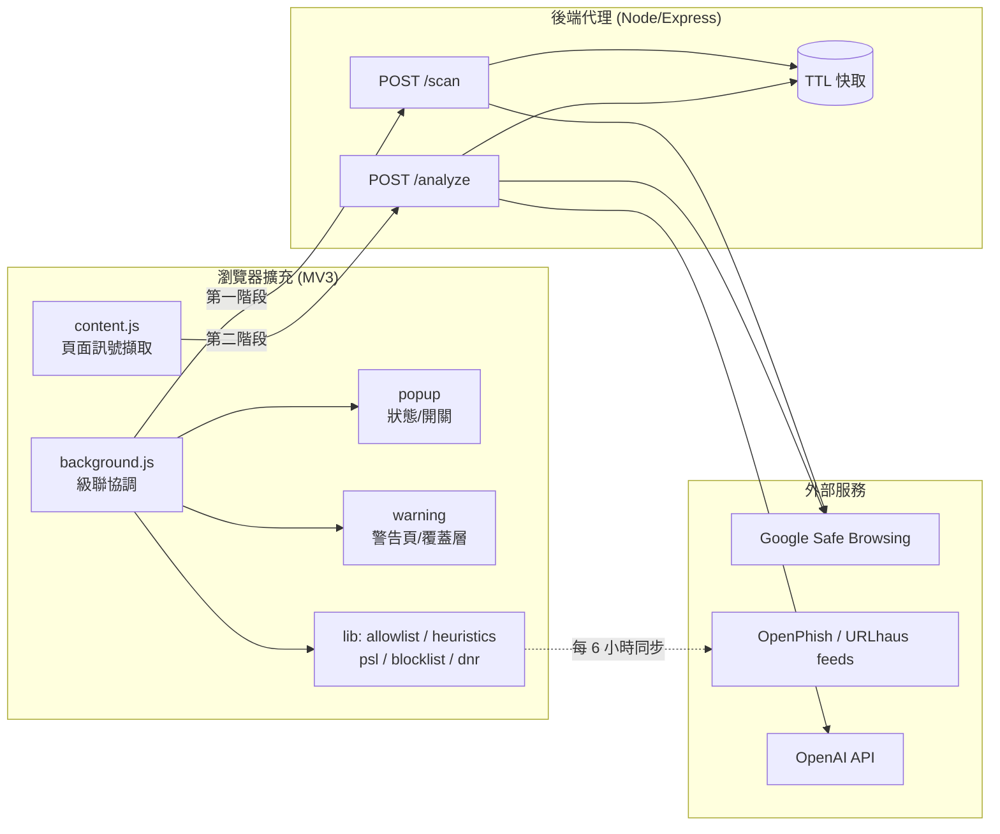
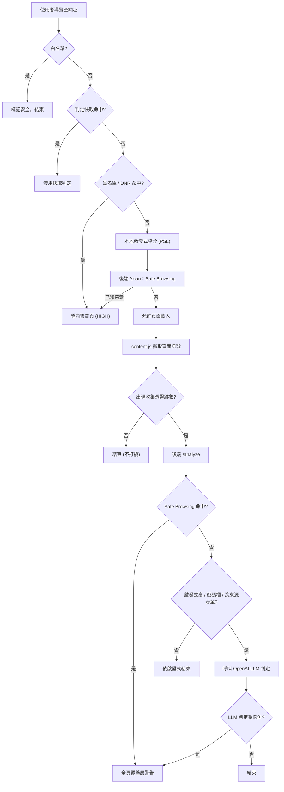

# Phishing Guard 開發進度報告

> 一個能在瀏覽時自動偵測釣魚／惡意網站的 Chrome 擴充功能（Manifest V3），
> 搭配一個輕量後端代理伺服器。
>
> 報告日期：2026-06-02

---

## 1. 專案概述

### 1.1 目標
打造一個能在使用者瀏覽網頁時，**即時、自動偵測釣魚與惡意網站**的瀏覽器擴充功能。

### 1.2 核心技術決策
- **不自行訓練模型**，改以 **API 金鑰**串接既有服務（使用者持有 OpenAI 金鑰）。
- 採用**分層偵測（tiered cascade）**架構：先用免費、即時、本地的檢查擋掉大部分情況，
  只有在真的需要時才呼叫昂貴的 LLM，藉此把成本與延遲壓到最低。
- **後端代理伺服器是必要的**：瀏覽器擴充功能無法安全地保存 API 金鑰
  （任何人都能解壓縮擴充功能讀出金鑰），因此金鑰必須放在伺服器端。

### 1.3 與最初 Gemini 建議的差異
最初的規劃過度龐大且與「不訓練模型」的前提矛盾，本專案做了以下調整：
- **移除** K-Means／Scikit-learn 機器學習模組（與「不訓練模型」衝突，且效果有限）。
- **移除** Docker／GCP／微服務等過度基礎建設，改用單一輕量 Node 後端。
- **改以 Google Safe Browsing 為主要信譽來源**（免費、專為此用途設計），
  而非速率受限的 VirusTotal。
- 以 **LLM 分析實際頁面內容**取代無監督式異常偵測，作為零時差（zero-day）偵測手段。

---

## 2. 系統架構

### 2.1 分層偵測級聯（Tiered Cascade）

| 層級 | 位置 | 成本 | 內容 |
| --- | --- | --- | --- |
| 1. 白名單 | 擴充功能 | 免費、即時 | 對信任的大型網站略過所有檢查 |
| 2a. 黑名單 | 擴充功能 | 免費、即時、可離線 | OpenPhish + URLhaus 動態同步，經由 declarativeNetRequest 強制阻擋 |
| 2b. 啟發式規則 | 擴充功能 | 免費、即時 | Punycode、仿冒網域、IP 主機、可疑 TLD、過深子網域、亂度（PSL 精準解析） |
| 3. 信譽查詢 | 後端 | 免費 | Google Safe Browsing 查詢已知惡意網址 |
| 4. LLM 判定 | 後端 | 付費 | 對出現收集憑證跡象的未知頁面，由 OpenAI 判斷 |

判定結果以 **網址路徑（origin + path）** 為單位快取，重複造訪不再產生成本。

### 2.2 兩階段偵測（因應 MV3 限制）
Manifest V3 無法在請求進行中暫停並等待伺服器回應，因此設計為兩階段：

- **第一階段（導覽時，`background.js`）**：白名單 → 快取 → 黑名單 → 啟發式 → 後端 `/scan`。
  已知惡意網址在頁面載入前就被導向警告頁。
- **第二階段（頁面載入後，`content.js`）**：擷取頁面訊號 → 後端 `/analyze`，
  必要時才升級到 LLM；若判定為釣魚則覆蓋全頁警告層。

### 2.3 目錄結構
```
phishing-extension/
├── extension/                 # MV3 擴充功能（純 JS，免建置）
│   ├── manifest.json
│   ├── config.js              # 後端網址、快取 TTL、風險等級
│   ├── background.js          # 第一階段級聯、訊息處理、黑名單/DNR 生命週期
│   ├── content.js             # 第二階段頁面訊號擷取 + 警告覆蓋層
│   ├── lib/
│   │   ├── allowlist.js       # 內建信任網域 + 仿冒比對品牌清單
│   │   ├── heuristics.js      # 本地啟發式規則
│   │   ├── blocklist.js       # OpenPhish/URLhaus 動態同步、解析、查詢
│   │   ├── dnr.js             # 黑名單 → declarativeNetRequest 規則
│   │   ├── psl.js             # Public Suffix List 演算法
│   │   ├── psl-data.js        # 內建 PSL 資料（自動產生）
│   │   ├── generate_psl.py    # 重新產生 PSL 資料
│   │   └── generate_icons.py  # 重新產生圖示（在 icons/）
│   ├── icons/                 # 盾牌圖示 16/32/48/128
│   ├── popup/                 # 狀態 UI、開關、信任此網站、黑名單狀態
│   └── warning/               # 全頁攔截警告頁
├── backend/                   # Node/Express 代理（保存金鑰）
│   ├── server.js              # /scan、/analyze、速率限制、快取
│   └── src/
│       ├── classify.js        # 風險/分類純函式（可測試）
│       ├── safeBrowsing.js    # Google Safe Browsing 串接
│       ├── llm.js             # OpenAI 串接
│       └── cache.js           # TTL 快取
├── tests/                     # Node 內建測試（25 項）
├── README.md
└── 開發進度報告.md            # 本報告
```

### 2.4 系統元件圖



### 2.5 偵測級聯流程圖



---

## 3. 各模組功能詳述

### 3.1 擴充功能（前端）

**白名單（`lib/allowlist.js`）**
- 內建約 50 個高信任網域（含台灣相關：`gov.tw`、`edu.tw`、`nycu.edu.tw`、
  各大銀行與電商）。
- 使用者可透過 popup 的「信任此網站」加入個人白名單，儲存於 `chrome.storage.local`。

**啟發式規則（`lib/heuristics.js`）**
- 偵測：Punycode／IDN 同形異義攻擊、原始 IP 主機、網址含 `@`、可疑 TLD、
  過深子網域、與知名品牌的編輯距離（仿冒）、字串亂度、超長網址。
- 以 **Public Suffix List** 正確解析可註冊網域（eTLD+1）。

**離線黑名單（`lib/blocklist.js` + `lib/dnr.js`）**
- 每 6 小時透過 `chrome.alarms` 同步兩個免費、免金鑰的來源：
  - **OpenPhish** 社群 feed → 釣魚
  - **URLhaus**（abuse.ch）online feed → 惡意軟體
- 條目正規化為 `主機 + 路徑`（去除 scheme／query／fragment），即使帶追蹤參數也能比對，
  且不會誤擋整個共用主機。
- 透過 **declarativeNetRequest 動態規則**在網路層攔截：在請求送出前、甚至在
  service worker 休眠時都能阻擋。「仍要前往」會新增較高優先權的 allow 規則以避免無限重導。

**UI（`popup/`、`warning/`）**
- Popup：當前網站風險（✅／⚠️／⛔）、偵測來源、原因、啟用開關、信任此網站、
  黑名單數量與手動更新按鈕。
- 警告頁／覆蓋層：依威脅類型顯示「釣魚」或「惡意軟體」不同文案，提供「返回安全」
  （直接關閉分頁，最可靠）與「仍要前往」。

### 3.2 後端代理（`backend/`）
- **`POST /scan`**：僅憑網址，Safe Browsing + 啟發式分數 → 風險等級。
- **`POST /analyze`**：網址 + 頁面訊號，必要時升級至 OpenAI。
- 保存 API 金鑰、每 IP 速率限制（token bucket）、依路徑快取判定結果。
- **優雅降級**：缺 Safe Browsing 金鑰時跳過該層；缺 OpenAI 金鑰時退回啟發式。

---

## 4. 開發歷程與解決的問題

開發過程中，透過實際測試發現並修正了多個真實問題：

| # | 問題 | 解法 |
| --- | --- | --- |
| 1 | `.env` 放在專案根目錄，後端讀不到（顯示金鑰未設定） | 移至 `backend/.env`（dotenv 的讀取位置） |
| 2 | 警告頁「返回」按鈕卡住（釣魚頁已進入歷史，返回又被擋，形成迴圈） | 改為透過背景訊息**關閉分頁**，最可靠 |
| 3 | 只有釣魚警告，無法區分惡意軟體 | 依 Safe Browsing 威脅類型分為 phishing／malware，UI 文案與圖示隨之變化 |
| 4 | **快取以主機為鍵造成污染**：同主機某頁的判定會套用到所有路徑（malware 被誤標成 phishing） | 改以 `origin + path` 為快取鍵（前後端一致） |
| 5 | OpenPhish `feed.txt` 已改為 302 轉址到 GitHub | 直接指向 GitHub raw 來源 |
| 6 | **啟發式對 `.tw`／`.co.uk` 完全失效**：把 `paypa1.com.tw` 的可註冊網域誤判為 `com.tw`，品牌標籤變成 `com`，仿冒偵測整個壞掉 | 導入 **Public Suffix List** 正確解析 eTLD+1 |
| 7 | 導入 PSL 後 `user.github.io` 被誤判（品牌字串出現在公用後綴中） | 品牌比對只在「非後綴」部分進行 |
| 8 | DNR 阻擋與「仍要前往」會互相衝突造成重導迴圈 | 「仍要前往」新增較高優先權的 allow 規則 |

---

## 5. 測試

- 以 Node 內建測試框架（`node --test`）涵蓋所有純邏輯，於專案根目錄執行：
  ```bash
  npm test     # 共 25 項，全數通過
  ```
- 涵蓋範圍：PSL 解析（含 `.tw`、`github.io`、萬用字元／例外規則）、啟發式規則
  （仿冒偵測、`github.io` 誤判修正、結構性紅旗）、黑名單正規化與 feed 解析、
  DNR 規則產生、後端風險／分類對應。
- 實機驗證：以 Google 官方測試網址確認釣魚／惡意軟體分類與攔截皆正確。

### 5.1 LLM 層驗證狀態
- LLM 層（`backend/src/llm.js`，預設模型 `gpt-4o-mini`）**已完整實作並串接**到 `/analyze`，
  且已驗證在「有密碼欄／跨來源表單」的頁面會被正確觸發。
- 目前實測時 OpenAI 回傳 **429 `billing_not_active`**（帳戶尚未啟用計費），
  程式依設計**優雅降級**回啟發式判定（`source` 顯示 `heuristics` 而非 `llm`）。
- **待 OpenAI 帳戶啟用計費後即可運作**，無需修改程式。屆時 `/analyze` 回應的
  `source` 會是 `llm` 並附帶 `explanation` 說明欄位。

---

## 6. 隱私設計
- 白名單網站完全不發出任何網路請求。
- 僅傳送網址與**輕量**頁面訊號（標題、文字片段、表單目標「主機名稱」、欄位數量），
  **不傳送**欄位內容、token 或 cookie。
- LLM 層僅在「未知且疑似收集憑證」的頁面才會被觸發。

---

## 7. 目前狀態與後續工作

### 已完成
- ✅ 五層偵測級聯（白名單／黑名單+DNR／啟發式／信譽／LLM）
- ✅ 兩階段偵測（導覽前攔截 + 載入後分析）
- ✅ 釣魚與惡意軟體分類、警告頁與覆蓋層
- ✅ 離線黑名單同步 + 網路層（DNR）強制阻擋
- ✅ Public Suffix List 精準網域解析
- ✅ 盾牌圖示與精緻化 popup
- ✅ 25 項自動化測試
- ✅ 後端代理（金鑰保護、速率限制、快取、優雅降級）

### 後續（需外部資源，非程式問題）
- ⬜ **台灣 165 反詐騙清單**：只需在 `blocklist.js` 的 `FEEDS` 陣列新增一筆，
  待確認穩定的純文字來源。
- ⬜ **水平擴展**：後端快取與速率限制目前為單一實例，可將 `cache.js` 換成 Redis。
- ⬜ 品牌比對仍用子字串搜尋，無關詞（如 "pineapple" 含 "apple"）可能輕微提高可疑度
  （不會直接攔截）。
- ⬜ DNR 重導的警告頁不會更新 popup 的分頁狀態（`onBeforeNavigate` 路徑會），屬輕微外觀落差。

---

## 8. 如何執行

**後端**
```bash
cd backend
npm install
cp .env.example .env      # 填入 OPENAI_API_KEY、GOOGLE_SAFE_BROWSING_KEY
npm start
```

**擴充功能**
1. 開啟 `chrome://extensions`，啟用「開發人員模式」。
2. 點「載入未封裝項目」，選擇 `extension/` 資料夾。
3. 若擴充功能要求新權限（DNR），請確認。

**測試**
```bash
npm test       # 於專案根目錄
```
